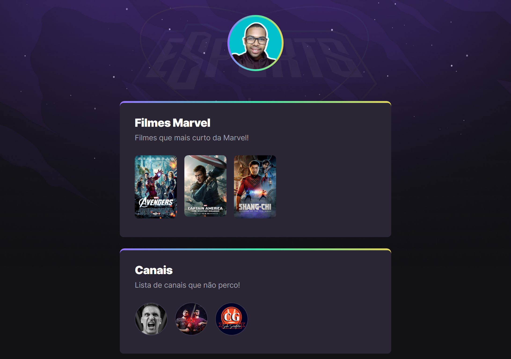

# NLW - eSports: Agregador de Links

>## Trilha Explorer

### Agregador de links, construído junto a Rocketseat no NLW eSports.
-
-
-

>## [🔗 Clique aqui para acessar!](https://josuedevgit.github.io/link-aggregator-nlw-esports/)

## 🛠️ Ferramentas

- HTML
- CSS
- Git
- GitHub

## 📧 Contato
- josueluzsilva.01@gmail.com

>## Primeiro Commit
- De grande aprendizado toda a aula prática deste projeto. 
Copy SVG no Figma, foi um aprendizado muito bacana, bem como usar imagens
nos links. Muito bacana!

>## Styles
- Os conceitos de estilização foram esclarecedores na aula.
padding, o CSS obedecendo a "cascata". Acho que finalmente entendi o
"Cascading".

>## Animations and Transitions
- Fora ter feito o alinhamento e design do <header>, aplicamos animações e transições no código.
Foi muito bacana, pois tive noção que o css também não só muda cor. Para mim, a "interatividade" só era
possível com JavaScript, mas hoje foi um "boom". Muito bacana!
